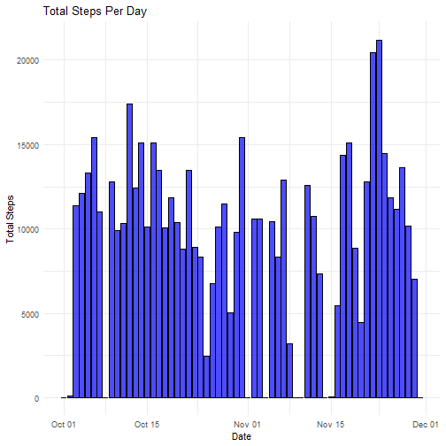
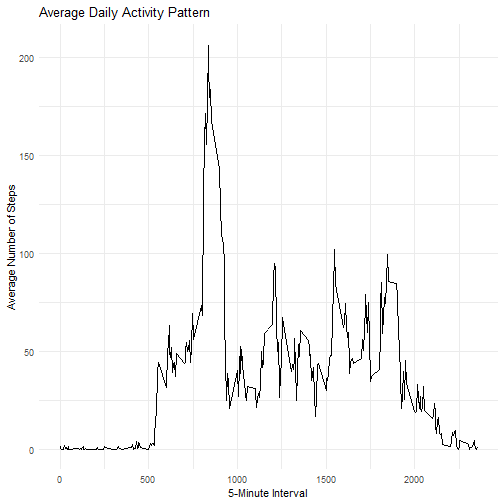
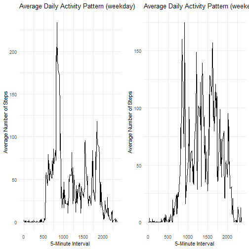

# Loading and preprocessing the data


``` r
library(readr)
activity <- read_csv("activity.csv")
```

```
## Rows: 17568 Columns: 3
## ── Column specification ──────────────────────────────────────────────────────────────────────────────────────────────────────────────────────────
## Delimiter: ","
## dbl  (2): steps, interval
## date (1): date
## 
## ℹ Use `spec()` to retrieve the full column specification for this data.
## ℹ Specify the column types or set `show_col_types = FALSE` to quiet this message.
```

# What is mean total number of steps taken per day?

## Calculate the total number of steps taken per day

``` r
library(tidyverse)
```

```
## Warning: package 'tidyverse' was built under R version 4.4.1
```

```
## Warning: package 'ggplot2' was built under R version 4.4.1
```

```
## Warning: package 'tibble' was built under R version 4.4.1
```

```
## Warning: package 'tidyr' was built under R version 4.4.1
```

```
## Warning: package 'purrr' was built under R version 4.4.1
```

```
## Warning: package 'dplyr' was built under R version 4.4.1
```

```
## Warning: package 'stringr' was built under R version 4.4.1
```

```
## Warning: package 'forcats' was built under R version 4.4.1
```

```
## Warning: package 'lubridate' was built under R version 4.4.1
```

```
## ── Attaching core tidyverse packages ────────────────────────────────────────────────────────────────────────────────────────── tidyverse 2.0.0 ──
## ✔ dplyr     1.1.4     ✔ purrr     1.0.2
## ✔ forcats   1.0.0     ✔ stringr   1.5.1
## ✔ ggplot2   3.5.1     ✔ tibble    3.2.1
## ✔ lubridate 1.9.3     ✔ tidyr     1.3.1
## ── Conflicts ──────────────────────────────────────────────────────────────────────────────────────────────────────────── tidyverse_conflicts() ──
## ✖ dplyr::filter() masks stats::filter()
## ✖ dplyr::lag()    masks stats::lag()
## ℹ Use the conflicted package (<http://conflicted.r-lib.org/>) to force all conflicts to become errors
```

``` r
total_steps_per_date <- activity %>% 
  group_by(date) %>% 
  summarize(total_steps = sum(steps, na.rm = TRUE))

print(total_steps_per_date)
```

```
## # A tibble: 61 × 2
##    date       total_steps
##    <date>           <dbl>
##  1 2012-10-01           0
##  2 2012-10-02         126
##  3 2012-10-03       11352
##  4 2012-10-04       12116
##  5 2012-10-05       13294
##  6 2012-10-06       15420
##  7 2012-10-07       11015
##  8 2012-10-08           0
##  9 2012-10-09       12811
## 10 2012-10-10        9900
## # ℹ 51 more rows
```
## Make a histogram of the total number of steps taken each day
The main difference between histogram and bar graph is whether the x axis is continuous or categorical.
In this assignment, the x axis is date. Although date is a continuous variable, it should be categorized as categorical in R plotting. Therefore, I used geom_bar() in the following code.


``` r
library(dplyr)
library(ggplot2)

ggplot(total_steps_per_date, aes(x = date, y = total_steps)) +
  geom_bar(stat = "identity", fill = "blue", color = "black", alpha = 0.7) +
  labs(title = "Total Steps Per Day", x = "Date", y = "Total Steps") +
  theme_minimal()
```



## Calculate and report the mean and median of the total number of steps taken per day


``` r
activity %>% 
  group_by(date) %>% 
  summarize(total_steps_mean = mean(steps, na.rm = TRUE),
            total_steps_median = median(steps, na.rm = TRUE))
```

```
## # A tibble: 61 × 3
##    date       total_steps_mean total_steps_median
##    <date>                <dbl>              <dbl>
##  1 2012-10-01          NaN                     NA
##  2 2012-10-02            0.438                  0
##  3 2012-10-03           39.4                    0
##  4 2012-10-04           42.1                    0
##  5 2012-10-05           46.2                    0
##  6 2012-10-06           53.5                    0
##  7 2012-10-07           38.2                    0
##  8 2012-10-08          NaN                     NA
##  9 2012-10-09           44.5                    0
## 10 2012-10-10           34.4                    0
## # ℹ 51 more rows
```

# What is the average daily activity pattern?

## Make a time series plot (i.e. type = "l") of the 5-minute interval (x-axis) and the average number of steps taken, averaged across all days (y-axis)


``` r
activity_time_series <- activity %>%
  group_by(interval) %>%
  summarize(average_steps = mean(steps, na.rm = TRUE))

ggplot(activity_time_series, aes(x = interval, y = average_steps)) +
  geom_line() +  
  labs(title = "Average Daily Activity Pattern",
       x = "5-Minute Interval", 
       y = "Average Number of Steps") +
  theme_minimal()
```



## Which 5-minute interval, on average across all the days in the dataset, contains the maximum number of steps?


``` r
activity_time_series %>%
  filter(average_steps == max(average_steps, na.rm = TRUE))
```

```
## # A tibble: 1 × 2
##   interval average_steps
##      <dbl>         <dbl>
## 1      835          206.
```
The answer is 8:35.


# Imputing missing values

## Calculate and report the total number of missing values in the dataset


``` r
missing_rows <- activity %>% filter(is.na(steps))
nrow(missing_rows)
```

```
## [1] 2304
```

## Devise a strategy for filling in all of the missing values in the dataset. The strategy does not need to be sophisticated.
In addition to using the mean/median for that day, or the mean for that 5-minute interval, other option includes to use preceding or succeeding values.

## Create a new dataset that is equal to the original dataset but with the missing data filled in.
Here, I try to fill in the missing values using the mean for that day.
If all the steps in that day are missing, I filled it as 0.


``` r
activity_filled <- activity %>% 
  group_by(date) %>% 
  mutate(steps = ifelse(is.na(steps), coalesce(mean(steps, na.rm = TRUE), 0), steps))
print(activity_filled)
```

```
## # A tibble: 17,568 × 3
## # Groups:   date [61]
##    steps date       interval
##    <dbl> <date>        <dbl>
##  1     0 2012-10-01        0
##  2     0 2012-10-01        5
##  3     0 2012-10-01       10
##  4     0 2012-10-01       15
##  5     0 2012-10-01       20
##  6     0 2012-10-01       25
##  7     0 2012-10-01       30
##  8     0 2012-10-01       35
##  9     0 2012-10-01       40
## 10     0 2012-10-01       45
## # ℹ 17,558 more rows
```

## Make a histogram of the total number of steps taken each day and Calculate and report the mean and median total number of steps taken per day. 


``` r
total_steps_per_date_filled <- activity_filled %>% 
  group_by(date) %>% 
  summarize(total_steps = sum(steps, na.rm = TRUE))

#Histgram
ggplot(total_steps_per_date_filled, aes(x = date, y = total_steps)) +
  geom_bar(stat = "identity", fill = "blue", color = "black", alpha = 0.7) +
  labs(title = "Total Steps Per Day", x = "Date", y = "Total Steps") +
  theme_minimal()
```


``` r
#Mean and median
activity_filled %>% 
  group_by(date) %>% 
  summarize(total_steps_mean = mean(steps, na.rm = TRUE),
            total_steps_median = median(steps, na.rm = TRUE))
```

```
## # A tibble: 61 × 3
##    date       total_steps_mean total_steps_median
##    <date>                <dbl>              <dbl>
##  1 2012-10-01            0                      0
##  2 2012-10-02            0.438                  0
##  3 2012-10-03           39.4                    0
##  4 2012-10-04           42.1                    0
##  5 2012-10-05           46.2                    0
##  6 2012-10-06           53.5                    0
##  7 2012-10-07           38.2                    0
##  8 2012-10-08            0                      0
##  9 2012-10-09           44.5                    0
## 10 2012-10-10           34.4                    0
## # ℹ 51 more rows
```

As long as I adopt the strategy to fill the missing values in 0, the results are similar.

# Are there differences in activity patterns between weekdays and weekends?

## Create a new factor variable in the dataset with two levels – “weekday” and “weekend” indicating whether a given date is a weekday or weekend day.


``` r
activity_weekday <- activity %>% 
  mutate(weekday = weekdays(date)) %>% 
  mutate(weekday_or_end = ifelse(weekday %in% c("Saturday", "Sunday"), "weekend", "weekday"))

print(activity_weekday)
```

```
## # A tibble: 17,568 × 5
##    steps date       interval weekday weekday_or_end
##    <dbl> <date>        <dbl> <chr>   <chr>         
##  1    NA 2012-10-01        0 Monday  weekday       
##  2    NA 2012-10-01        5 Monday  weekday       
##  3    NA 2012-10-01       10 Monday  weekday       
##  4    NA 2012-10-01       15 Monday  weekday       
##  5    NA 2012-10-01       20 Monday  weekday       
##  6    NA 2012-10-01       25 Monday  weekday       
##  7    NA 2012-10-01       30 Monday  weekday       
##  8    NA 2012-10-01       35 Monday  weekday       
##  9    NA 2012-10-01       40 Monday  weekday       
## 10    NA 2012-10-01       45 Monday  weekday       
## # ℹ 17,558 more rows
```

## Make a panel plot containing a time series plot of the 5-minute interval (x-axis) and the average number of steps taken, averaged across all weekday days or weekend days (y-axis). 


``` r
#weekday
activity_time_series_weekday <- activity_weekday %>%
  filter(weekday_or_end=="weekday") %>% 
  group_by(interval) %>%
  summarize(average_steps = mean(steps, na.rm = TRUE))

plot_weekday <- ggplot(activity_time_series_weekday, aes(x = interval, y = average_steps)) +
  geom_line() +  
  labs(title = "Average Daily Activity Pattern (weekday)",
       x = "5-Minute Interval", 
       y = "Average Number of Steps") +
  theme_minimal()

#weekend
activity_time_series_weekend <- activity_weekday %>%
  filter(weekday_or_end=="weekend") %>% 
  group_by(interval) %>%
  summarize(average_steps = mean(steps, na.rm = TRUE))

plot_weekend <- ggplot(activity_time_series_weekend, aes(x = interval, y = average_steps)) +
  geom_line() +  
  labs(title = "Average Daily Activity Pattern (weekend)",
       x = "5-Minute Interval", 
       y = "Average Number of Steps") +
  theme_minimal()

#Arrange
library(gridExtra)
```

```
## Warning: package 'gridExtra' was built under R version 4.4.2
```

```
## 
## Attaching package: 'gridExtra'
```

```
## The following object is masked from 'package:dplyr':
## 
##     combine
```

``` r
grid.arrange(plot_weekday, plot_weekend, ncol = 2)
```



In weekends, the total number of steps increases in the afternoon.
